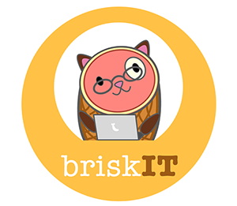

# Travis CI

# BriskIT

App for IT help

There's a small setup process for this project
1) I would setup a virtualenv. This [link](http://stackoverflow.com/questions/12410113/migrating-virtualenv-and-github-between-computers) shows it well.

2) So basically: clone, create virtualenv, activate it, install everything, and you can run the project

3) You can use [pluralsight](http://www.pluralsight.com/courses/django-fundamentals) to ramp up. You can start your free trial, or talk to me tomorrow about it.
 This is the [site](http://www.django-rest-framework.org/tutorial/1-serialization/) for the API tutorial

Project Management
[trello](https://trello.com/b/Bb9gVAFI/ithelp-app)
